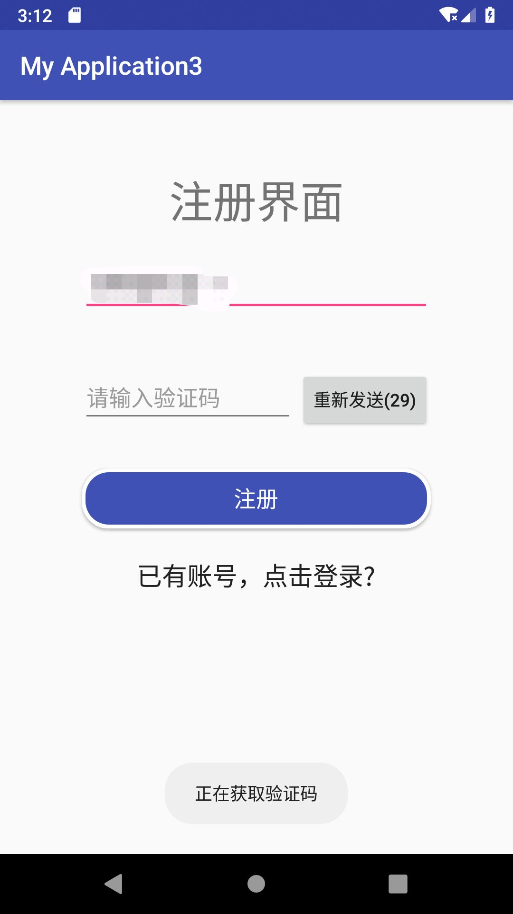
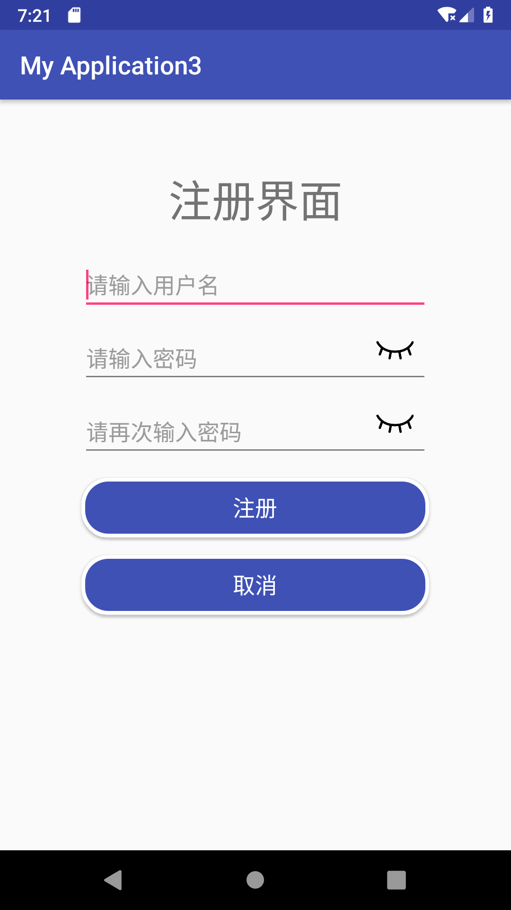
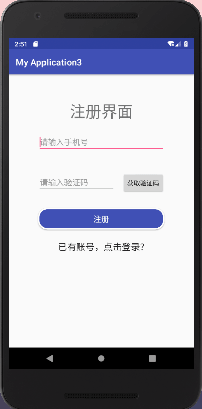

Demo
=======

1.输入手机号获取验证码，同时自动注册，未注册时跳转到第二个注册页面，已注册时直接跳转到个人中心

    

2.第二个注册页面输入用户名和密码，点击注册跳转到登录界面

    

3.登录界面可以查看密码，点击自动更换验证码，同时可以记住密码

    

4.成功登录以后跳转到个人中心（个人中心未完善）

    

5.跳转到其他APP（未完善）

    
    

